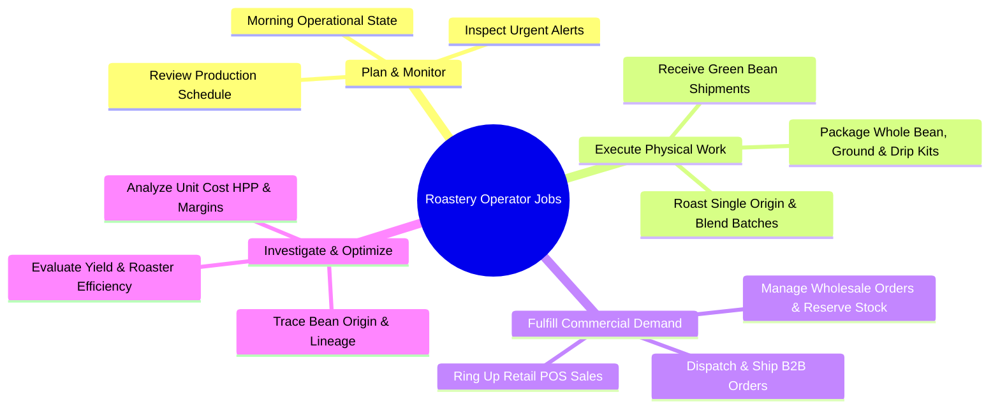
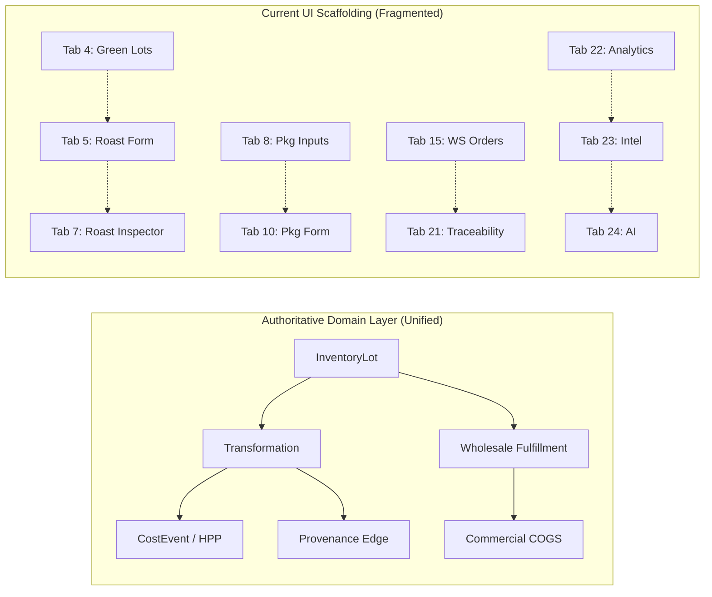

# Phase 13: Roastery OS Product Experience Re-Architecture Audit

**Date**: September 2026  
**Type**: System-Level Product Experience Audit (READ-ONLY)  
**Evaluator**: Lead Product & Architecture Auditor  
**System Scope**: Modules 01–12 (`Master Data`, `Inventory`, `Roasting`, `Blend`, `Production`, `POS`, `Costing`, `Traceability`, `Supplier`, `Wholesale`, `Analytics`, `Intelligence`, `AI Layer`)  
**UI Surface Audited**: 24 Diagnostic Screens (`packages/app-api/public/index.html`, `app.js`, `app.css`)

---

## 1. Executive Summary

Roastery OS has successfully achieved an extraordinary engineering milestone: a **100% transactionally verified, multi-tenant, double-entry ledger spine** operating under strict PostgreSQL row-level locks across the entire coffee roasting lifecycle:

$$\text{Supplier PO} \longrightarrow \text{Inbound Receipt} \longrightarrow \text{Green Lot} \longrightarrow \text{Roasting} \longrightarrow \text{Roasted Lot} \longrightarrow \text{Blend} \longrightarrow \text{Blend Lot} \longrightarrow \text{Packaging} \longrightarrow \text{Finished SKU} \longrightarrow \begin{cases} \text{POS} \\ \text{Wholesale} \end{cases} \longrightarrow \text{COGS}$$

All 88 automated tests execute green. Economic absorption, acyclic provenance DAGs, analytical read models, deterministic intelligence rules, and grounded AI reasoning function flawlessly at the domain layer.

However, when stepped back and audited strictly through the lens of a **daily roastery operator**, the current user interface reveals a stark dissonance:

> **The primary user experience is currently an engineering diagnostic console reflecting the database schema and incremental build phases, rather than a coherent operational cockpit for running a craft coffee business.**

The user interface exposes 24 flat, horizontally scrolling numbered tabs (`1. Receiving (POs)` through `24. AI Penalaran Operasional`), forcing the operator to act as a manual data router across isolated tables.

---

## 2. Current Product Reality

### "If I were a roastery operator using this system every day, what does Roastery OS actually feel like?"

1. **It feels like driving a car by looking at the wiring diagram instead of the dashboard.**
   - To fulfill a single wholesale order, an operator must mentally navigate:
     - Tab 15 (*Pesanan Wholesale*) to view the order $\rightarrow$
     - Tab 16 (*Kelola & Reservasi*) to manually allocate stock $\rightarrow$
     - Tab 10 (*Packaging Execution*) if stock is insufficient $\rightarrow$
     - Tab 8 (*Packaging Inputs*) to check roasted bulk inventory $\rightarrow$
     - Tab 5 (*Roast Transformation*) to roast more green beans $\rightarrow$
     - Tab 4 (*Green Lots*) to check raw bean availability $\rightarrow$
     - Tab 1 (*Receiving*) to see if new green beans arrived.
2. **It forces the operator to memorize the system's database schema.**
   - Physical lots (`InventoryLot`), commercial products (`SKUMaster`), ledger movements (`stock_ledger_movement`), and DAG nodes (`provenance_edge`) are presented as separate destinations rather than integrated views of the same physical coffee.
3. **It operates with high transactional safety, but zero ambient situational awareness.**
   - The operator cannot glance at the screen at 7:00 AM and instantly know:
     - *What needs to be roasted today?*
     - *What wholesale orders must be dispatched by 2:00 PM?*
     - *Which high-demand SKUs are critically low on stock?*

---

## 3. Current Mental Model

The current interface enforces a **Sequential Linear Pipeline Mental Model (Model A)**:

$$\text{Screen 1} \rightarrow \text{Screen 4} \rightarrow \text{Screen 5} \rightarrow \text{Screen 8} \rightarrow \text{Screen 10} \rightarrow \text{Screen 12/15} \rightarrow \text{Screen 21} \rightarrow \text{Screen 22} \rightarrow \text{Screen 23} \rightarrow \text{Screen 24}$$

This implies that a roastery operates in a strict, single-threaded waterfall sequence:
1. First, we receive.
2. Then, we roast.
3. Then, we blend.
4. Then, we package.
5. Then, we sell.
6. Then, we open an inspector.

### The Real Operator Mental Model (Model B)
In reality, a roastery is a **continuous, asynchronous, concurrent hub**:
- While the head roaster is executing 4 roast batches on the 15kg Giesen,
- The production team is bagging 200 retail pouches of House Blend,
- The B2B sales lead is entering a 50kg wholesale order for a cafe client,
- The barista is ringing up flat whites and 250g retail bags at the POS counter,
- The inventory manager is inspecting an arriving 10-bag pallet of Flores Bajawa.

The operator does not think: *"I am at Step 5 of the 24-step database pipeline."*  
The operator thinks: **"What is the physical state of my roastery, what needs attention right now, and what work must get done today?"**

---

## 4. Why It Feels Like a Production Line

The observation that *"the UI feels like a production line"* is technically accurate. The underlying causes are classified below:

| UI Attribute | Underlying Cause | Classification | Impact on Operator Experience |
| :--- | :--- | :--- | :--- |
| **Numbered Flat Subnav** | 24 numbered buttons in the top navbar (`1. Receiving` to `24. AI`). | **A. Diagnostic Scaffolding Artifact** | Creates overwhelming horizontal clutter; impossible to scale. |
| **Separate "Inspector" Screens** | Dedicated standalone screens (Screens 3, 7, 11, 14, 17, 20) to view completed entities. | **A. Diagnostic Scaffolding Artifact** | Fractures workflow. Inspecting a lot requires leaving the active workspace. |
| **Form-First Without Context** | Roasting/Packaging screens are blank data-entry forms requiring manual selection of Lot IDs from memory or dropdowns. | **B. Genuine Product Problem** | High cognitive load. Roasters cannot see machine capacity or batch queues. |
| **Table-First Presentation** | Nearly every screen starts with a generic data table. | **A. Diagnostic Scaffolding Artifact** | Lacks visual hierarchy. Critical low stock looks identical to abundant stock. |
| **Leaked Database Terminology** | Terms like `transformation_input`, `Acyclic DAG`, `Full Absorption`, `Lot Valuation Record`. | **B. Genuine Product Problem** | Intimidates craft roasters who understand coffee processes, not relational data models. |
| **Strict Physical Conservation** | Exact mass balance tracking (Green Mass = Roasted Output + Chaff Loss). | **C. Useful Operational Structure (KEEP)** | Essential for real roastery unit economics and traceability. |
| **Full Absorption Cost Tracking** | Automatic propagation of raw bean cost + packaging + conversion fee into lot HPP. | **C. Useful Operational Structure (KEEP)** | Unique competitive advantage of Roastery OS over generic inventory tools. |

---

## 5. Diagnostic Scaffolding vs. Genuine Product Problems

```
+-----------------------------------------------------------------------------------+
|                        SCAFFOLDING vs PRODUCT PROBLEMS                            |
+---------------------------------------------+-------------------------------------+
| Diagnostic Scaffolding (Easy to Refactor)   | Genuine Product Architecture Gaps   |
+---------------------------------------------+-------------------------------------+
| • 24 numbered subnav buttons                | • Lack of a unified "Today" view    |
| • 6 separate "Inspector" screens            | • Disconnected Lot vs SKU views     |
| • Disabled tabs requiring local action      | • Costing hidden in raw tables      |
| • Raw database table names on UI pills      | • Traceability isolated in Screen 21|
| • Ephemeral clientside state resets         | • AI isolated in Screen 24          |
+---------------------------------------------+-------------------------------------+
```

---

## 6. Operator Jobs (Jobs-To-Be-Done)

Derived from the actual domain services and PostgreSQL schema, the real operational jobs supported by Roastery OS are:



### Job Profiles

1. **Morning Roastery Standup & Triage** (Frequency: Daily, Urgency: HIGH)
   - *Job*: Check inventory levels, see upcoming wholesale dispatch commitments, identify bottlenecks.
   - *Current Friction*: Must click across Tabs 22, 23, 15, and 8 to assemble this picture.
2. **Execute Roast Batch** (Frequency: Multiple times/day, Urgency: HIGH)
   - *Job*: Select green lot, charge roaster, record roast yield and chaff loss, print batch record.
   - *Current Friction*: Screen 5 requires manually scrolling through green lot UUIDs.
3. **Blend & Package Finished SKUs** (Frequency: Daily, Urgency: MEDIUM)
   - *Job*: Package roasted beans into 250g/1kg pouches or drip boxes.
   - *Current Friction*: Screen 10 requires selecting coffee lot and pouch lot separately without BOM locking.
4. **B2B Wholesale Order Fulfillment** (Frequency: Continuous, Urgency: HIGH)
   - *Job*: Review customer PO, reserve available finished stock, fulfill, dispatch, and check margin.
   - *Current Friction*: Split across Screen 15 (List), Screen 16 (Manage/Reserve), and Screen 17 (Inspector).
5. **Quality, Cost & Lineage Deep Dive** (Frequency: Ad-hoc / Weekly, Urgency: MEDIUM)
   - *Job*: Investigate why a lot's HPP is high or trace an espresso blend back to its farm receipt.
   - *Current Friction*: Traceability is isolated on Screen 21; Costing is isolated on Screen 22; AI is isolated on Screen 24.

---

## 7. Tasks vs. Entities vs. Modules

| Architecture Model | Structure | Pros | Cons | Verdict for Roastery OS |
| :--- | :--- | :--- | :--- | :--- |
| **A. Module-First** | 12 separate modules (Inventory, Roasting, Blend, POS, Wholesale, etc.) | Matches backend package boundaries cleanly. | Fragmented user workflow; high navigation overhead. | **REJECT** for top-level navigation. |
| **B. Entity-First** | Lots, Products, SKUs, Orders, Suppliers, Recipes. | Excellent for data lookup, search, and indexing. | Obscures daily operational tasks and production flows. | **PARTIAL** (Best for deep inspection). |
| **C. Work-First** | Operations Hub, Production, Commercial Orders, Inventory, Insights. | Directly aligns with daily operator mental model. | Requires careful design so master data is still discoverable. | **RECOMMENDED (HYBRID WORK + CONTEXTUAL ENTITIES)** |

### The Winning Model: **Hybrid Work-First with Contextual Entity Workspaces**
- Top-level navigation organized by **Operational Domains of Work** (`Today`, `Production`, `Inventory`, `Orders`, `Intelligence`).
- Entity detail views organized as **Contextual Workspaces** (e.g. clicking a Lot opens everything about that lot: physical stock, lineage DAG, cost breakdown, transformation history, and active reservations).

---

## 8. Current Navigation Audit (24 Screens)

```
====================================================================================================
EXISTING 24 DIAGNOSTIC SCREENS IN packages/app-api/public/index.html
====================================================================================================
[RECEIVING]
1. Receiving (POs)          2. PO Detail               3. Receiving Inspector*
[ROASTING]
4. Green Lots               5. Roast Execution         6. Roast History           7. Roast Inspector*
[PACKAGING / FINISHED GOODS]
8. Packaging Inputs         9. Products & SKUs         10. Packaging Execution   11. FG Inspector*
[POS / RETAIL]
12. POS Kasir               13. POS Orders             14. POS Inspector*
[WHOLESALE / B2B]
15. Wholesale Orders        16. Wholesale Manage       17. Wholesale Inspector*
[BLENDING]
18. Blend Recipes           19. Blend Execution        20. Blend Inspector*
[TRACEABILITY & REASONING]
21. Traceability Explorer   22. Operational Analytics  23. Operational Intelligence 24. Operational AI
====================================================================================================
* Denotes a disabled/ephemeral "Inspector" screen that should not exist as a top-level tab.
```

---

## 9. Cross-Module Experience

The domain layer is tightly integrated, but the UI presents synthetic silos:



### The Friction Points
1. **Lot $\rightarrow$ Lineage**: A user on Screen 4 (Green Lots) cannot directly click a lot to see its forward lineage; they must copy the Lot Number and navigate to Screen 21 (Traceability Explorer).
2. **Order $\rightarrow$ Costing**: A wholesale order on Screen 15 shows total revenue, but to inspect the absorbed COGS of the fulfilled lot, the user must navigate to Screen 17 or Screen 22.
3. **Signal $\rightarrow$ Action**: Screen 23 (Intelligence) flags an aging green lot, but clicking "Resolve" merely switches tabs without pre-populating the roast batch form.

---

## 10. Contextual Workspace Opportunities

Rather than forcing the operator to jump across 24 screens, Roastery OS has the exact underlying data to provide rich **Contextual Entity Drawers / Workspaces**:

### Example A: The Lot 360° Workspace
When an operator clicks `LOT-RST-HOUSE-001` anywhere in the app, a sliding contextual drawer displays:
- **Physical Position**: `15.00 KG on hand` | `8.00 KG reserved` | `7.00 KG available` | Location: `Bin R-02`.
- **Economic Value**: Capitalized HPP $= \text{IDR } 185,000\text{/KG}$ (Material: 85%, Conversion: 15%).
- **Upstream Origin**: Formulated from `LOT-RST-FLORES-001 (60%)` and `LOT-RST-COLOMBIA-001 (40%)`.
- **Downstream Usage**: Packaged into 20 bags of `FG-HOUSE-1KG-WB`.
- **Commercial Exposure**: 2 bags allocated to Wholesale Order `WS-2026-001`.
- **Active Signals**: None (Normal).

### Example B: The Commercial SKU 360° Workspace
When an operator clicks `SKU-ESP-1KG`:
- **Current Commercial Velocity**: 45 units sold this month across POS (20) and Wholesale (25).
- **Physical Stock Reality**: 12 units on hand, 8 reserved for B2B, **only 4 available for walk-in retail**.
- **Financial Margin**: Retail Price $\text{IDR } 280,000$ vs Average HPP $\text{IDR } 165,000 \rightarrow \mathbf{41.1\% \text{ Gross Margin}}$.
- **Operational Recommendation**: *"Schedule packaging batch: 15 KG of bulk roasted blend ready in Bin R-02."*

---

## 11. Information Hierarchy

```
+-----------------------------------------------------------------------------------+
|                        PROPOSED INFORMATION HIERARCHY                             |
+-----------------------------------------------------------------------------------+
| LEVEL 1: PRIMARY (Ambient / Actionable)                                          |
| "What needs my attention right now? What work must get done today?"               |
| → Low stock alerts, urgent B2B shipments, daily roast/packaging tasks, yield warnings.
+-----------------------------------------------------------------------------------+
| LEVEL 2: SECONDARY (Execution Workspaces)                                         |
| "I am doing the work right now."                                                  |
| → Roasting execution cockpit, packaging batch flow, POS register, wholesale desk. |
+-----------------------------------------------------------------------------------+
| LEVEL 3: TERTIARY (Entity Lists & Management)                                     |
| "I want to inspect or manage assets."                                             |
| → Stock ledger, catalog/SKUs, customer accounts, supplier purchase orders.        |
+-----------------------------------------------------------------------------------+
| LEVEL 4: DEEP CONTEXT (Lineage, Cost Absorption & AI Reasoning)                   |
| "Why is this happening? Where did this come from?"                                |
| → 360° Traceability DAG, Full Absorption breakdown, grounded AI explanation.     |
+-----------------------------------------------------------------------------------+
```

---

## 12. Terminology Audit

| Term in Current UI | Where Found | Operator Perception | Recommended Treatment | Operator-Facing Replacement |
| :--- | :--- | :--- | :--- | :--- |
| **`Transformation`** | Screens 5, 6, 7, 10, 19 | Relational database jargon. | **CONTEXTUALIZE** | *"Roasting Batch"* / *"Packaging Batch"* / *"Blending Batch"* |
| **`InventoryLot`** | Screens 4, 8, 21 | Sounds like a programming class. | **RENAME** | *"Stock Lot"* / *"Batch Lot"* (e.g. `Lot #`) |
| **`Acyclic DAG Matrix`** | Screens 7, 11, 21 | Computer science graph term. | **RENAME** | *"Lot Lineage & Traceability"* |
| **`Total Economic Pool`** | Screens 7, 11 | Corporate accounting abstraction. | **RENAME** | *"Total Batch Cost (HPP)"* |
| **`Cost Event`** | Screens 7, 11 | Ledger accounting term. | **RENAME** | *"Direct Operational Expense"* / *"Labor & Packaging Fee"* |
| **`Full Absorption`** | Screens 5, 10 | Cost accounting jargon. | **HIDE / DEFAULT** | Default to Standard Absorption; hide behind advanced toggle. |
| **`Stock Ledger Movement`** | Screen 3 | ERP terminology. | **RENAME** | *"Stock History"* / *"Movement Audit"* |
| **`Evidence Matrix`** | Screens 23, 24 | Diagnostic verification term. | **CONTEXTUALIZE** | *"Verified System Evidence"* |
| **`HPP / COGS`** | Screens 7, 14, 17, 22 | Understood by business owners. | **KEEP** | *HPP (Harga Pokok Produksi)* / *Gross Margin* |
| **`Yield (Rendemen)`** | Screens 5, 6, 7, 22 | Industry standard roasting term. | **KEEP** | *Rendemen Roasting (%)* |

---

## 13. Screen Inventory & Re-Architecture Strategy

| Current Screen | Current Purpose | Primary Job | Verdict | Target Destination in Future Product |
| :--- | :--- | :--- | :--- | :--- |
| **Screen 1: PO List** | Inbound purchase orders | Purchasing & Receiving | **MERGE** | `Inventory → Inbound Shipments` |
| **Screen 2: PO Detail** | Line inspection & receive trigger | Purchasing & Receiving | **MERGE** | Inbound Shipment Drawer / Modal |
| **Screen 3: Receipt Inspector** | Diagnostic receipt output | Verification | **REMOVE** | Replaced by toast notification + Lot 360° drawer |
| **Screen 4: Green Lots** | Raw coffee inventory | Stock Monitoring & Roasting Prep | **MERGE** | `Inventory → Green Coffee` |
| **Screen 5: Roast Execution** | Execute roasting batch | Physical Roasting | **MOVE** | `Production → Roasting Cockpit` |
| **Screen 6: Roast History** | List past roast batches | Production Review | **MERGE** | `Production → Batch History` |
| **Screen 7: Roast Inspector** | Diagnostic roast output | Post-roast Inspection | **REMOVE** | Replaced by Batch 360° Drawer |
| **Screen 8: Packaging Inputs** | Roasted lots + pouches list | Packaging Prep | **MERGE** | `Production → Packaging Cockpit` |
| **Screen 9: Products & SKUs** | Commercial catalog | Product Management | **MOVE** | `Catalog & SKUs` |
| **Screen 10: Pkg Execution** | Execute packaging batch | Packaging Assembly | **MOVE** | `Production → Packaging Cockpit` |
| **Screen 11: FG Inspector** | Diagnostic packaging output | Post-packaging Inspection | **REMOVE** | Replaced by Finished Lot 360° Drawer |
| **Screen 12: POS Kasir** | Retail counter sales | Walk-in Cashiering | **KEEP** | `Commercial → POS Register` |
| **Screen 13: POS Orders** | Retail order history | Sales Audit | **MERGE** | `Commercial → Sales & Orders` |
| **Screen 14: POS Inspector** | Diagnostic POS output | Sales Inspection | **REMOVE** | Replaced by Order 360° Drawer |
| **Screen 15: WS Orders** | B2B wholesale orders | B2B Commercial Sales | **MERGE** | `Commercial → Wholesale Hub` |
| **Screen 16: WS Manage** | Reserve & fulfill B2B orders | Order Fulfillment | **MERGE** | `Commercial → Wholesale Hub` |
| **Screen 17: WS Inspector** | Diagnostic wholesale output | Order Inspection | **REMOVE** | Replaced by Order 360° Drawer |
| **Screen 18: Blend Recipes** | Formulation master | Blend R&D & Formulation | **MERGE** | `Production → Blend Formulations` |
| **Screen 19: Blend Execution** | Execute blending batch | Physical Blending | **MERGE** | `Production → Blending Cockpit` |
| **Screen 20: Blend Inspector** | Diagnostic blend output | Post-blend Inspection | **REMOVE** | Replaced by Batch 360° Drawer |
| **Screen 21: Traceability** | Standalone lineage search | Recall / Lineage Audit | **MOVE** | Integrated into Global Search & Lot 360° Drawer |
| **Screen 22: Analytics** | Analytical read models | Executive & Plant Review | **MERGE** | `Insights & Business Performance` |
| **Screen 23: Intelligence** | Operational signals & alerts | Daily Triage & Monitoring | **MERGE** | `Today / Operations Cockpit` |
| **Screen 24: Operational AI** | Grounded Q&A reasoning | Decision Support & Q&A | **MERGE** | Ambient Assistant / `Ask Roastery OS` bar |

---

## 14. Backend vs. Frontend Boundary

```
+------------------------------------------------------------------------------------+
|                         BACKEND vs FRONTEND BOUNDARY                               |
+---------------------------------------------------+--------------------------------+
| Backend Architecture (Preserve Modular Engines)   | User Experience (Unified Work) |
+---------------------------------------------------+--------------------------------+
| • 01 Master Data                                  | ──┐                            |
| • 02 Inventory Engine                             |   ├─→ 📦 INVENTORY & STOCK     |
| • 09 Supplier System                              | ──┘                            |
|                                                   |                                |
| • 03 Roasting Engine                              | ──┐                            |
| • 04 Blend Engine                                 |   ├─→ ⚙️ PRODUCTION COCKPIT    |
| • 05 Production Engine                            | ──┘                            |
|                                                   |                                |
| • 06 POS Engine                                   | ──┐                            |
| • 10 Customer Wholesale                           |   ├─→ 🛒 COMMERCIAL & ORDERS   |
|                                                   | ──┘                            |
|                                                   |                                |
| • 07 Costing Engine                               | ──┐                            |
| • 08 Batch Traceability                           |   ├─→ 🔍 CONTEXTUAL DRAWERS    |
|                                                   | ──┘   (Lot / SKU / Order 360°) |
|                                                   |                                |
| • 11 Analytics                                    | ──┐                            |
| • 12 Intelligence                                 |   ├─→ 🧭 OPERATIONS HOME       |
| • 13 AI Reasoning                                 | ──┘   (Today + Ambient AI)     |
+---------------------------------------------------+--------------------------------+
```

---

## 15. Analytics / Intelligence / AI Experience

In the current UI, Analytics (Screen 22), Intelligence (Screen 23), and AI Reasoning (Screen 24) are three distinct tabs. An operator must figure out which tab contains the answer.

### The Unified Cognitive Experience
In the target product experience, these three layers merge into a single **Ambient Intelligence Surface**:
1. **The System Observes (Analytics)**: Background aggregates compute yields, margins, and stock positions.
2. **The System Highlights (Intelligence)**: Amber/Red badges appear directly on affected inventory lots, production batches, and commercial orders.
3. **The System Explains (AI Reasoning)**: Clicking any alert or opening the global search bar allows the operator to ask *"Why is this flagged?"* and immediately receives a grounded, evidence-backed explanation with recommended human actions.

---

## 16. Roastery OS Product Identity Opportunities

What makes Roastery OS uniquely **Roastery OS** (and not generic Odoo, NetSuite, or Shopify)?

1. **The Integrity of the Physical Transformation Spine**:
   - Roastery OS treats coffee as a living, transforming physical substance. Mass and cost propagate with scientific precision from the green farm sack to the roasted batch, through blend homogenization, into the valve-sealed bag.
2. **True Full Absorption Unit Economics**:
   - Every single bag of coffee knows its exact unit HPP based on the actual green beans consumed, the actual roasting shrinkage experienced, the physical packaging pouch used, and the direct machine labor incurred.
3. **Bi-Directional Botanical & Commercial Lineage**:
   - Any customer holding a cup of espresso or a 250g retail bag can be traced backward in milliseconds through roasting batches to the exact supplier delivery and farm origin.
4. **Advisory Decision Support Grounded in Physical Facts**:
   - The system does not hallucinate advice. It reasons strictly over verified ledger facts, calculating fulfillment constraints and supply chain bottlenecks before they halt operations.

---

## 17. Product Experience Principles

Derived from the audit evidence, the core product principles for Roastery OS are:

1. **Navigate by Work, Not by Database Schema**:
   - Operators navigate to where their work happens (`Production`, `Orders`, `Stock`), not to backend engine names.
2. **Context Over Isolated Inspectors**:
   - Every entity (Lot, SKU, Order, Batch) is its own 360° workspace containing its physical balance, cost structure, lineage tree, and active signals.
3. **Ambient Situational Awareness First**:
   - Opening the system immediately answers: *"What needs attention right now, and what work is scheduled for today?"*
4. **Physical Reality is Non-Negotiable**:
   - The UI never allows fictional inventory or unbacked conversions. Mass conservation, batch shrinkage, and reservation holds are clearly visualized.
5. **AI is an Explanatory Partner, Never an Autonomous Actor**:
   - AI explains facts, highlights uncertainties, and suggests actions, but humans always pull the lever.

---

## 18. Proposed Candidate Information Architectures

### Candidate Architecture 1: The Operator Cockpit (Recommended)

```
ROASTERY OS
├── 1. 🧭 TODAY (Operations Cockpit)
│   ├── Urgent Attention & Intelligence Alerts (Phase 11)
│   ├── Today's Production Schedule (Roast & Packaging Batches)
│   ├── Outbound Commercial Shipments (POS & Wholesale Fulfillment)
│   └── Ambient "Ask Roastery OS" Bar (Phase 12 Grounded AI)
│
├── 2. ⚙️ PRODUCTION (Physical Transformation Hub)
│   ├── Roasting Cockpit (Green selection → Roast batch → Drop yield & chaff)
│   ├── Blending Cockpit (Recipe formulation → Multi-lot blend execution)
│   ├── Packaging Cockpit (Roasted bulk + Pouches → Finished SKUs)
│   └── Batch History & Quality Log
│
├── 3. 📦 INVENTORY & STOCK (Physical Ledger Hub)
│   ├── Green Coffee Lots (Origin, Moisture, Warehouse, Sacks)
│   ├── Roasted Bulk Coffee (Intermediate Bins, Degassing Age)
│   ├── Packaging & Consumables (Pouches, Valves, Drip Kits, Boxes)
│   ├── Finished Goods & SKUs (Available vs Reserved Stock)
│   └── Inbound Deliveries & Purchase Orders
│
├── 4. 🛒 COMMERCIAL (Sales & Fulfillment Hub)
│   ├── B2B Wholesale Desk (Orders, Customer Terms, Allocations, Dispatch)
│   ├── Retail POS Kasir (Counter Checkout, Cash/QRIS Shifts)
│   ├── Customer Accounts (Credit limits, pricing tiers)
│   └── Completed Order History & COGS Breakdown
│
└── 5. 📊 INSIGHTS & AUDIT (Deep Intelligence Hub)
    ├── Financial & Gross Margin Analysis
    ├── Roaster Efficiency & Yield Performance
    ├── Supplier Contribution & Spend Concentration
    └── Global Batch Traceability & Lineage Audit
```

---

## 19. Recommended Direction

The recommended product evolution strategy is:

1. **Retain 100% of the Existing Backend Services**:
   - All 12 domain and application packages remain completely untouched. The database schema, domain models, costing formulas, and analytics read models are rock-solid.
2. **Consolidate Navigation from 24 Tabs into 5 Workstream Hubs**:
   - `Today`, `Production`, `Inventory`, `Commercial`, and `Insights`.
3. **Replace Standalone "Inspector" Screens with Contextual Drawers**:
   - Clicking any Lot ID or Order Number opens a slide-over drawer displaying its 360° profile (Physical state + Cost breakdown + Lineage DAG + Active alerts).
4. **Embed AI Reasoning as an Ambient Command Bar**:
   - Transform Screen 24 into a persistent global query interface (*"Ask Roastery OS..."*) accessible from any screen with context awareness.

---

## 20. What NOT to Change Yet

1. **DO NOT modify the backend engine architecture or domain contracts.**
2. **DO NOT alter the database schema or PostgreSQL table constraints.**
3. **DO NOT change the Full Absorption costing algorithms or ledger movement rules.**
4. **DO NOT introduce third-party UI framework bloat or heavyweight state libraries.**
5. **DO NOT implement autonomous AI write agents.**

---

## 21. Open Product Questions

1. **Floor Hardware & Touch Optimization**:
   - Should the Roasting and Packaging cockpits feature large-format touch buttons optimized for tablet mounting next to the roaster (e.g. iPad on a RAM mount)?
2. **Degassing & Freshness Windows**:
   - How should roasted bulk inventory visually communicate resting/degassing age (e.g. *Optimal brew window: Day 7–30*) to prevent premature packaging?
3. **Multi-Warehouse Physical Bin Locations**:
   - When should explicit physical shelf/bin locations (e.g. `Pallet G-04`, `Silo B-02`) become primary visual markers on the inventory floor plan?

---

## 22. Final Verdict

### **VERDICT: C — CURRENT UI SHOULD BE SIGNIFICANTLY RE-ARCHITECTED**

> **Justification**:  
> The underlying engine stack (`domain-core`, `contracts`, `application-services`, `infrastructure-postgres`, `app-api`) is exceptionally mature, correct, and robust. However, the current 24-screen interface is an engineering diagnostic scaffold that mirrors the database schema rather than the operator's operational reality.  
> 
> Re-architecting the front-end into **5 Unified Operational Hubs with Contextual 360° Drawers** will elevate Roastery OS from a collection of verified database modules into a category-defining, world-class operational operating system for the craft coffee industry.
