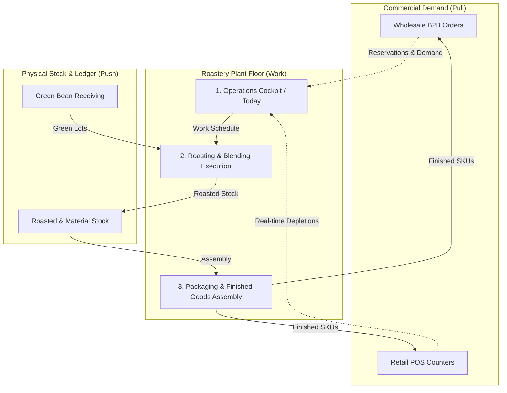
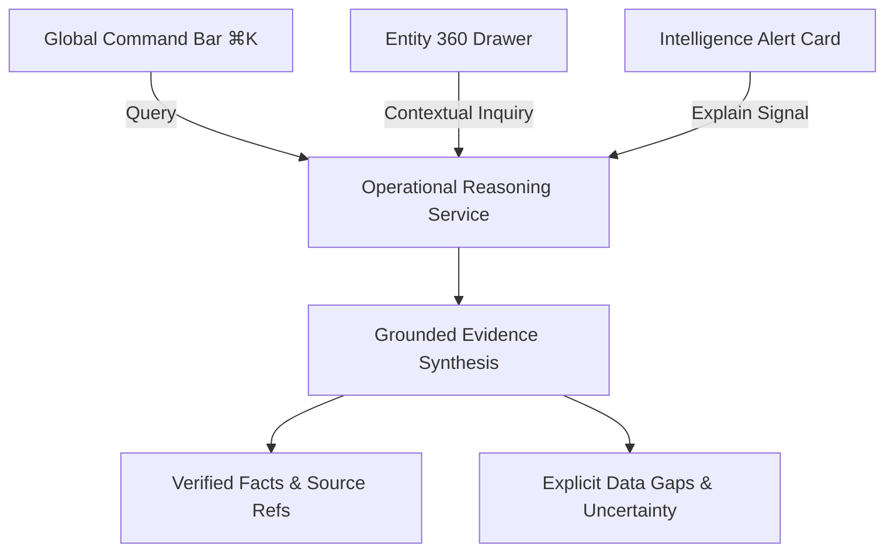

# Phase 14: Roastery OS Product Experience Architecture & Information Architecture Blueprint

**Status**: HARDENED — READY FOR FRONTEND EXPERIENCE IMPLEMENTATION (`DESIGN & BLUEPRINT GATE`)  
**Scope**: Product-Level Information Architecture, Navigation Design, Contextual 360° Entity Experience, Action Architecture, Terminology Standards, and Migration Blueprint for Roastery OS  
**Date**: September 2026  
**Audience**: Product Designers, Frontend Engineers, Domain Architects, Roastery Plant Operators

---

## Phase 14.1 Hardening Notes

Phase 14.1 performed a comprehensive hardening pass on this blueprint to ensure it serves as a strict, safe, and unambiguous contract for frontend implementation without introducing scope creep, unsupported ERP assumptions, or domain distortions.

### Key Hardening Corrections Applied:
1. **Scope Hardening & Elimination of ERP Creep**:
   - Explicitly categorized and removed unsupported ERP functionality from the core contract (e.g. Accounts Receivable, Credit Terms, Invoicing, Shift Balancing ledger, generic MRP engines, Barcode Printing, and Delivery Address Books).
   - Marked prospective features clearly as `FUTURE / OUT OF CURRENT SCOPE` or `OPEN PRODUCT DECISION`.
2. **Terminology & Domain Boundary Protection**:
   - Purged computer science / graph theory jargon (e.g. `DAG Search`, `Lineage DAG`, `Acyclic DAG Matrix`) from the operator-facing experience. Replaced with operator-aligned terms: **Lineage Explorer**, **Silsilah Lot**, and **Traceability Graph**.
   - Standardized operator UI terminology to **Lot** while preserving `InventoryLot` as the internal domain/backend concept.
   - Clarified the operational boundaries: `BlendRecipe` (formulation intent) vs. `Transformation` (material conversion execution) vs. `Batch` (operational execution context).
3. **De-biasing Examples vs. Frozen Rules**:
   - Reclassified heuristic examples (e.g., *82.0% standard yield reference*, *degassing rest duration indicators*, *warehouse bin labels*) as `DERIVED PRESENTATION / HEURISTIC EXAMPLES` rather than hardcoded domain constraints.
   - Clarified that packaging material suggestions derive directly from `sku_master.material_id` rather than an automated generic BOM/MRP calculation engine.
4. **Action Architecture & Journey Realism**:
   - Audited all proposed operational actions across four strict classes (`EXISTING EXECUTABLE ACTION`, `EXISTING WITH CONTEXTUAL ENTRY POINT`, `FUTURE ACTION`, `UNSUPPORTED ACTION`).
   - Grounded the 6 core operator journeys strictly in implemented capabilities, preventing implied automation where manual operator execution is required.
5. **Entity 360° Drawers Grounding**:
   - Grounded Lot 360°, SKU 360°, Order 360°, and Batch 360° views in data structures that exist today (`physical quantity`, `reserved quantity`, `allocated balance`, `full absorption valuation`, `provenance ledger`).
   - Removed speculative properties (e.g. botanical genetics, predictive degassing curves, automated bin routing).
6. **Product Identity & Design Gate**:
   - Removed marketing superlatives ("industry's first...", "true botanical...") in favor of an exact architectural definition:
     > *"Roastery OS is an operational system for managing the physical, commercial, economic, and traceability reality of a coffee roastery."*
   - Explicitly ratified that Phase 14.1 freezes product mental models, information architecture, navigation, and contracts—**not** final visual styling/tokens.
7. **Validation-First Rebuild Strategy**:
   - Replaced naive batch rewrites with a 5-step validation-first sequence centered on validating a single vertical slice (`Today` $\rightarrow$ `Lot` $\rightarrow$ `Roast` $\rightarrow$ `Lot 360` $\rightarrow$ `Packaging`) against real operator mental models before scaling.

---

## 1. Executive Summary

Phase 13 audited the existing 24-screen diagnostic scaffolding and conclusively established that:
> **The backend architecture is mature, sound, and transactionally verified, but the user interface represents an engineering console rather than an intuitive, craft-aware operating environment for a roastery.**

Phase 14 (hardened in Phase 14.1) defines the **Product Experience Architecture & Information Architecture Blueprint**. It translates the underlying engine stack (Inventory, Roasting, Blending, Production, Costing, Traceability, Supplier, Wholesale, POS, Analytics, Intelligence, and AI) into a human-centered operational operating system without modifying a single line of domain code, database DDL, or costing mathematics.

```
+----------------------------------------------------------------------------------------------------+
|                                    ROASTERY OS PRODUCT VISION                                      |
+----------------------------------------------------------------------------------------------------+
|  FROM: 24 isolated, numbered diagnostic tabs reflecting internal tables and build milestones       |
|  TO:   5 unified Operational Workstream Hubs with Ambient Situational Awareness & Contextual 360° |
+----------------------------------------------------------------------------------------------------+
```

---

## 2. Product Identity & Definition

> **Roastery OS is an operational system for managing the physical, commercial, economic, and traceability reality of a coffee roastery.**

### Architectural Distinctions (Why It Differs from Generic ERP):
1. **Physical Transformation at the Core**: Generic ERPs treat inventory as static numbers in tables. Roastery OS models the physical reality of coffee: mass conversion, unrecoverable shrinkage, intermediate resting, and discrete packaging assembly.
2. **Full Absorption Unit Economics**: Every packaged unit carries its accumulated unit cost derived from green bean acquisition, direct roasting shrinkage/conversion, blending, and packaging material costs.
3. **Unbroken Operational Provenance**: Lineage is an intrinsic property of every stock movement, linking suppliers, raw materials, transformations, finished inventory, and commercial dispatches.
4. **Grounded Operational Reasoning**: An intelligence and reasoning layer that derives insights strictly from ledger facts and verifiable evidence without autonomous database writes.

---

## 3. Product Mental Model: The Concurrent Roastery Hub

A roastery is an **asynchronous, continuous physical and commercial operation**.



The operator's mental model centers on four fundamental operational questions:
1. **"What needs my attention right now?"** (Situational Triage & Alerts)
2. **"What work must be executed today?"** (Roasting, Blending, Packaging, Receiving)
3. **"What is the physical reality of my stock?"** (On-hand vs. Reserved vs. Free Available)
4. **"What is the commercial and economic health of my business?"** (Fulfillments, Cashiering, Gross Margins, Traceability)

---

## 4. Operational Scope Audit & Capability Classification

To prevent scope creep and maintain architectural integrity, all proposed capabilities are explicitly audited and classified:

| Functional Area / Proposed Feature | Classification | Hardened Architectural Boundary & Status |
| :--- | :--- | :--- |
| **Green Coffee & Material Receiving** | `SUPPORTED NOW` | PO and direct receiving into `inventory_lot` with landed cost absorption. |
| **Roasting Execution & Loss Tracking** | `SUPPORTED NOW` | Single-origin batch transformation with green charge, output weight, and yield calculation. |
| **Blending Execution** | `SUPPORTED NOW` | Multi-lot roasted coffee blending with live cost pooling against `blend_recipe`. |
| **Packaging & Assembly** | `SUPPORTED NOW` | Direct conversion of roasted coffee + packaging pouch into sellable SKU finished lots. |
| **Wholesale Order Management & Allocation**| `SUPPORTED NOW` | Draft, confirmed, allocated, and fulfilled order workflow with stock reservations. |
| **POS Cashiering & Instant Depletion** | `SUPPORTED NOW` | Retail counter checkout with immediate stock ledger deductions and realized COGS. |
| **Lineage & Traceability Graph** | `SUPPORTED NOW` | Upstream/downstream provenance graph derived from `provenance_edge` ledger. |
| **Deterministic Intelligence & Signals** | `SUPPORTED NOW` | Stock alerts, yield anomalies, margin compression, and bottleneck detection. |
| **Ambient AI Reasoning** | `SUPPORTED NOW` | Read-only natural language reasoning over structured evidence matrices. |
| **Automatic BOM / Generic MRP Engine** | `DERIVED FROM EXISTING DATA` | Packaging inputs derived directly from `sku_master.material_id`. No generic MRP engine. |
| **Warehouse Storage Bins / Silo Semantics** | `DERIVED PRESENTATION / HEURISTIC`| Basic location strings permitted in Lot metadata; no complex 3D bin routing engine. |
| **Degassing Curve & Optimal Date Calculators**| `DERIVED PRESENTATION / HEURISTIC`| Rest age derived from `transformation.created_at`; standard curves are heuristic examples. |
| **Accounts Receivable & Invoicing** | `FUTURE / OUT OF CURRENT SCOPE` | Commercial fulfillment realizes COGS and logs order revenue; full AR/invoicing deferred. |
| **Customer Credit Terms & Balances** | `FUTURE / OUT OF CURRENT SCOPE` | Wholesale customer master exists; credit limits and terms ledger deferred. |
| **Cash Drawer / Shift Balancing Ledger** | `FUTURE / OUT OF CURRENT SCOPE` | POS records cash/QRIS tender types per transaction; formal cashier shift balancing deferred. |
| **Barcode / Label Printing System** | `FUTURE PRODUCT CAPABILITY` | Lot and SKU codes displayed on-screen; physical thermal printer integration deferred. |
| **Automated Material Planning & Auto-Locking**| `FUTURE PRODUCT CAPABILITY` | Suggestions surfaced to operator; manual confirmation required for all allocations. |
| **Delivery Address Books & Logistics Routing**| `FUTURE / OUT OF CURRENT SCOPE` | Basic delivery recipient captured on order; advanced logistics address books deferred. |
| **Machine Notes & Maintenance Schedules** | `OPEN PRODUCT DECISION` | Free-text operational notes can be logged on batches; full maintenance suite deferred. |

---

## 5. Recommended Information Architecture (The 5-Hub Model)

The product information architecture is structured into **5 Operational Workstream Hubs**:

```
ROASTERY OS
│
├── 🧭 1. TODAY (Operations Cockpit & Ambient Situational Awareness)
│   ├── Urgent Attention & Intelligence Triage
│   ├── Active Production Run Schedule
│   ├── Outbound Commercial Commitments (Wholesale + POS Overview)
│   └── Ambient "Ask Roastery OS" Command Interface
│
├── ⚙️ 2. PRODUCTION (Physical Transformation & Process Execution)
│   ├── Roasting Cockpit (Single Origin Transformations & Mass Yield)
│   ├── Blending Cockpit (Formulation Intent & Multi-Lot Blending)
│   ├── Packaging Cockpit (Whole Bean, Ground, Drip Kit Assembly)
│   └── Production Batch History & Quality Log
│
├── 📦 3. INVENTORY (Physical Stock & Supply Ledger)
│   ├── Green Coffee (Origin, Lot Codes, Moisture, Landed Cost)
│   ├── Roasted Bulk Coffee (Roast Batches, Intermediate Stock, Rest Days)
│   ├── Packaging Consumables (Pouches, Valves, Cartons)
│   ├── Finished Goods & SKUs (Packaged Goods, Reserved vs. Free Available)
│   └── Inbound Deliveries & Purchase Orders
│
├── 🛒 4. COMMERCIAL (Sales, Allocation & Fulfillment Hub)
│   ├── Wholesale Desk (B2B Orders, Line Reservations, Dispatch Fulfillment)
│   ├── POS Kasir (Counter Register, Instant Depletion, Receipt Log)
│   ├── Wholesale Customer Catalog (B2B Directory & Price Schedules)
│   └── Commercial Order Audit & Realized Margins
│
└── 📊 5. INSIGHTS (Performance Analytics, Traceability & Quality Hub)
    ├── Financial & Gross Margin Analysis
    ├── Roaster Efficiency & Yield Deviation Trends
    ├── Supplier Contribution & Procurement Concentration
    └── Global Traceability Graph & Lot Pedigree Explorer
```

---

## 6. Primary Navigation & Interaction Framework

### Desktop & Tablet Workspace Layout:
- **Persistent Left Sidebar Navigation**: 5 primary hubs (`Today`, `Production`, `Inventory`, `Commercial`, `Insights`).
- **Global Header Bar**:
  - Roastery Organization Context (`Master Roastery Tenant`)
  - Ambient Persistent Command Bar: `Ask Roastery OS... (⌘K)`
  - Active Attention Counter Badge (Color-coded indicator for unaddressed critical signals)
  - Active User Profile & Operational Role Indicator
- **Main Canvas Workspace**: High-density, task-focused active workspace tailored to the selected hub.
- **Slide-Over Drawer (Right 40% Width)**: Contextual 360° inspector for any clicked Lot, SKU, Order, Batch, or Supplier, preserving screen context without full-page redirection.

---

## 7. Hub Deep Dives

### Hub 1: 🧭 Today (Operations Cockpit & Situational Triage)
- **Role**: Situational awareness and daily operational entry point for roastery managers, head roasters, and shift leads.
- **Boundaries**: Surfaces Analytics and Intelligence outputs; **does not own** analytics calculation or business engines.
- **Key Modules**:
  1. **Attention Feed**: Interactive signal cards derived from Phase 11 (`LOW_AVAILABLE_STOCK`, `YIELD_DEVIATION`, `MARGIN_COMPRESSION`, `CROSS_MODULE_BOTTLENECK`) with contextual jump triggers.
  2. **Active Production Schedule**: Visual queue of batches planned or required to fulfill current stock levels.
  3. **Outbound Fulfillment Progress**: Summary of pending wholesale orders requiring allocation or dispatch.
  4. **Ambient Reasoning Bar**: Natural language query interface powered by the read-only Phase 12 reasoning service.

### Hub 2: ⚙️ Production (Physical Transformation Hub)
- **Role**: Physical execution workspace for roasters and production operators.
- **Boundaries**: Distinguishes **Formulation Intent** (`BlendRecipe`), **Material Conversion Execution** (`Transformation`), and **Operational Execution Context** (`Batch`).
- **Operational Cockpits**:
  1. **Roasting Cockpit**:
     - Select Green Coffee Lot (displaying free available mass and lot valuation).
     - Enter Green Charge Mass ($\text{KG}$).
     - Execute Roast: Record Roasted Output Mass ($\text{KG}$) and optional Chaff Loss ($\text{KG}$).
     - Live Mass Balance indicator displaying calculated Yield % and physical mass balance.
  2. **Blending Cockpit**:
     - Select Blend Formulation (e.g. *House Blend 60:40*).
     - Select specific active roasted component lots.
     - Execute multi-lot homogenization with automated cost pooling.
  3. **Packaging Cockpit**:
     - Select Target SKU (e.g. *House Blend 250g Whole Bean*).
     - Link source roasted coffee lot and packaging pouch lot (derived from SKU configuration).
     - Enter finished package quantity ($\text{Units}$).
     - Live deduction of bulk coffee mass ($\text{KG}$) and packaging pouches ($\text{Units}$) into finished SKU lots.

### Hub 3: 📦 Inventory (Physical Stock & Supply Ledger)
- **Role**: Authoritative physical ledger view of all physical materials and assets.
- **Operator-Facing Segregation**:
  - **Green Coffee**: Origin, Lot ID, available mass ($\text{KG}$), landed unit cost.
  - **Roasted Bulk Coffee**: Rest duration, intermediate lot ID, available mass ($\text{KG}$), accumulated HPP.
  - **Packaging Consumables**: Stand-up pouches, valves, cartons, available unit balances.
  - **Finished Goods (SKUs)**: Sellable variants, total on-hand, reserved quantity, unreserved free available stock.
  - **Inbound Deliveries**: Open Purchase Orders, partial receipts, receiving inspection triggers.

### Hub 4: 🛒 Commercial (Sales, Allocation & Fulfillment Hub)
- **Role**: B2B order management, stock reservations, retail cashiering, and fulfillment.
- **Boundaries**: Strictly manages commercial sales, allocations, and stock depletions. Full double-entry accounting, credit limits, and invoicing ledger are deferred to future ERP integration phases.
- **Sub-Workspaces**:
  - **Wholesale B2B Desk**: Commercial orders across draft, confirmed, allocated, and fulfilled states with multi-item stock reservation and dispatch fulfillment.
  - **POS Cashier Counter**: Touch-friendly checkout register for counter sales, cash/QRIS tender logging, and real-time inventory depletion.
  - **Wholesale Customer Directory**: Customer master records and associated wholesale price lists.

### Hub 5: 📊 Insights (Performance Analytics & Lineage Hub)
- **Role**: Unified analytical decision support, quality review, and compliance auditing.
- **Boundaries**: Preserves the strict separation between Analytics (measured history), Intelligence (signals requiring attention), Traceability (provenance graph), and AI (grounded reasoning).
- **Integrated Capabilities**:
  - **Financial Performance**: Realized gross margins per channel (POS vs. Wholesale) and SKU profitability.
  - **Roaster Efficiency**: Physical yield ratios, unrecoverable waste trends, and conversion cost benchmarks.
  - **Supplier Contribution**: Spend share per vendor and procurement concentration.
  - **Global Traceability Graph (Lineage Explorer)**: Interactive provenance graph traversing green lots $\leftrightarrow$ roast batches $\leftrightarrow$ blend lots $\leftrightarrow$ packaged retail lots $\leftrightarrow$ commercial orders.

---

## 8. Contextual Entity Experience (The 360° Drawer Model)

Instead of navigating away from the current workspace to isolated inspect screens, clicking any primary entity opens a **Slide-Over 360° Drawer**:

```
+-------------------------------------------------------------+
| [X] LOT 360°: LOT-RST-HOUSE-2026-001                        |
+-------------------------------------------------------------+
| 📦 PHYSICAL POSITION                                        |
| Total On-Hand: 25.00 KG | Reserved: 15.00 KG | Avail: 10.00 KG |
| Rest Duration: 4 Days | Nature: ROASTED_BULK                |
+-------------------------------------------------------------+
| 💰 ECONOMIC VALUATION (Full Absorption)                     |
| Capitalized HPP: IDR 185,000 / KG                           |
| • Raw Material Cost: IDR 160,000 (86.5%)                    |
| • Roasting Conversion Fee: IDR 25,000 (13.5%)                |
+-------------------------------------------------------------+
| 🌿 BI-DIRECTIONAL LOT LINEAGE (Silsilah Lot)                |
| [Upstream Origin Lots]                                      |
|   ├── LOT-GRN-FLORES-001 (60% component)                    |
|   └── LOT-GRN-COLOMBIA-001 (40% component)                  |
| [Downstream Descendant Lots]                                |
|   └── 40 Units packaged into LOT-PKG-HOUSE-250G             |
+-------------------------------------------------------------+
| 🛒 COMMERCIAL ALLOCATIONS                                   |
| • 15.00 KG allocated to Wholesale Order WS-2026-003         |
+-------------------------------------------------------------+
| ⚠️ ACTIVE INTELLIGENCE SIGNALS                              |
| [ATTENTION] High reservation pressure: 60% locked.          |
+-------------------------------------------------------------+
| [ Contextual Actions: Package Lot | View Full Traceability ]|
+-------------------------------------------------------------+
```

### Supported 360° Entity Capabilities:

| Entity Type | Currently Available & Derivable Information | Future / Deferred Information |
| :--- | :--- | :--- |
| **Lot 360°** | Physical mass/units, reserved balance, free available, unit HPP, material vs. conversion breakdown, upstream parent lots, downstream child lots, active commercial reservations, intelligence signals. | Precise 3D warehouse bin routing, predictive degassing curves, automated thermal printing. |
| **SKU 360°** | Sellable product name, unit price, weighted unit HPP, realized gross margin %, total on-hand units, reserved units, active wholesale order demand lines. | Dynamic automated tier pricing engine, predictive demand forecasting. |
| **Order 360°** | Customer name, order status (Draft/Confirmed/Allocated/Fulfilled), line items, reservation status per line, realized COGS, realized gross margin. | Invoice tax generation, payment ledger integration, delivery tracking GPS. |
| **Batch 360°** | Transformation type, input lots & mass, output lots & mass, calculated yield %, physical mass balance delta, applied conversion fees, operator notes. | Real-time IoT roast profile curves (e.g. Artisan/Cropster curve overlays). |
| **Supplier 360°**| Supplier profile, total PO count, total spend volume, delivered green coffee lots, quality & yield summary. | Supplier credit terms ledger, automated purchase contract drafting. |

---

## 9. Action Architecture & Cross-Module Journeys

### Action Classification:
- **[Class A] Existing Executable Action**: Fully implemented in application services and API.
- **[Class B] Existing with Contextual Entry Point**: Implemented action invoked with pre-filled entity context.
- **[Class C] Future Action**: Defined in UX architecture but requires future backend support.
- **[Class D] Unsupported Action**: Removed from core scope to prevent architectural creep.

| Action Name | Class | Implementation Status & Entry Rule |
| :--- | :--- | :--- |
| `Receive Material` | **Class A** | Executable in Inbound Deliveries / Lot creation (`createLot`). |
| `Roast Batch` | **Class B** | Executable in Roasting Cockpit; pre-populates green lot from Lot 360°. |
| `Blend Lots` | **Class B** | Executable in Blending Cockpit; pre-populates formulation from Recipe catalog. |
| `Package SKU` | **Class B** | Executable in Packaging Cockpit; pre-populates roasted lot from Lot 360°. |
| `Reserve Stock` | **Class A** | Executable in Wholesale Order Desk (`allocateStock`). |
| `Fulfill Order` | **Class A** | Executable in Wholesale Order Desk (`fulfillOrder`). |
| `POS Checkout` | **Class A** | Executable in POS Cashier Register (`checkoutOrder`). |
| `Trace Lineage` | **Class A** | Executable in Lineage Explorer / Lot 360° (`getLotTrace`). |
| `Ask AI` | **Class A** | Executable via Ambient Command Bar `⌘K` or Drawer (`reasonOperationalQuery`).|
| `Print Barcode` | **Class C** | Future capability; displays formatted lot string on-screen currently. |
| `Auto-Plan MRP` | **Class D** | Unsupported; operator manually selects recipes and inputs. |
| `Shift Balancing`| **Class C** | Future capability; transaction history logged currently. |

---

### Hardened Core Operator Journeys:

```
+----------------------------------------------------------------------------------------------------+
|                                      HARDENED OPERATOR JOURNEYS                                    |
+----------------------------------------------------------------------------------------------------+
| JOURNEY 1: Inbound Green Coffee Receipt to Roasting                                                |
| Delivery arrives → Open PO Drawer → Click "Receive Material" → Creates Green Lot →                 |
| Click "Roast Batch" in Lot 360° → Pre-populates Roasting Cockpit with Green Lot. Zero tab hopping. |
+----------------------------------------------------------------------------------------------------+
| JOURNEY 2: Roasted Bulk Coffee to Packaging Execution                                              |
| Low finished stock signal on Today → Open Packaging Cockpit → Select Target SKU →                 |
| Select available Roasted Bulk Lot & Packaging Pouch Lot → Enter package count → Execute assembly.  |
+----------------------------------------------------------------------------------------------------+
| JOURNEY 3: Wholesale B2B Order Allocation & Fulfillment                                            |
| Order confirmed → Open Wholesale Desk → Click "Allocate Stock" for line items →                    |
| System reserves inventory → Click "Fulfill Order" → Deducts stock & realizes unit COGS.            |
+----------------------------------------------------------------------------------------------------+
| JOURNEY 4: Intelligence Signal Investigation & Evidence Audit                                      |
| Red alert on Today ("Yield Deviation: TRX-001 (78.0%)") → Click alert → Opens Batch 360° with      |
| Evidence Matrix → Click "Ask Roastery OS" → Explains loss context → Operator reviews batch record.  |
+----------------------------------------------------------------------------------------------------+
| JOURNEY 5: Retail POS Walk-in Sale & Instant Depletion                                             |
| Customer orders at counter → POS Register → Select SKU variants → Log tender (Cash/QRIS) →         |
| Instant inventory deduction → Generates receipt with unbroken batch lineage reference.             |
+----------------------------------------------------------------------------------------------------+
| JOURNEY 6: Traceability Lineage Investigation (Farm-to-Cup / Cup-to-Farm)                          |
| Customer inquiry on retail bag → Insights Hub → Lineage Explorer → Enter Lot Code →                |
| Visualizes complete pedigree graph: Green Sacks → Roast Batch → Blend Run → Package Lot.           |
+----------------------------------------------------------------------------------------------------+
```

---

## 10. Information Hierarchy Standards

Every screen in Roastery OS adheres to a 4-level progressive disclosure standard:

| Level | Role | UI Expression | Concrete Example |
| :--- | :--- | :--- | :--- |
| **Level 1: NOW** | Immediate attention & active status | Color-coded badges, status pills, urgent action triggers | *"Stok Tersedia Habis (0 KG)"* |
| **Level 2: WORK** | Active operational task execution | Dedicated forms, batch calculators, checkout registers | *Roast Execution Form* |
| **Level 3: CONTEXT** | Entity summaries & balance tables | High-density data tables with search, filter, and sorting| *Green Coffee Lots Table* |
| **Level 4: DEEP AUDIT** | Complete economic, botanical & lineage history | Slide-over 360° Drawers, Evidence Matrices | *Full Absorption Lot Lineage* |

---

## 11. Terminology Standards (Operator Vocabulary vs. Backend Concepts)

To prevent technical graph and database terminology from leaking into the user interface, frontend representations follow strict terminology mapping:

| Backend / Domain Concept | Operator-Facing UI Term | UI Context & Display Rules |
| :--- | :--- | :--- |
| `InventoryLot` | **Lot** (e.g. `Lot #`) | Display as clean alphanumeric codes (e.g. `LOT-GRN-001`). Hide database UUIDs. |
| `Transformation` | **Batch Produksi / Sangrai / Kemas** | Use context-specific names: *Roast Batch*, *Blend Run*, *Packaging Batch*. |
| `ProvenanceEdge` / `DAG` | **Silsilah Lot (Lineage)** | Visualized as interactive pedigree trees. **Never use "DAG" in user-facing UI.** |
| `CostEvent` | **Biaya Konversi / Biaya Tenaga Kerja** | Display as direct production expense breakdown. |
| `LotValuationRecord` | **Struktur HPP Lot** | Display as `HPP Satuan (IDR/KG)` with Material vs. Conversion cost breakdown. |
| `StockLedgerMovement` | **Riwayat Pergerakan Stok** | Display as chronological ledger cards with audit timestamps. |
| `BlendRecipe` | **Formulasi Resep Blend** | Formulation intent defining target component percentages. |
| `FullAbsorption` | *[Standard System Costing]* | Automated underlying valuation behavior; hide theoretical accounting jargon. |
| `EvidenceMatrix` | **Matriks Bukti Terverifikasi** | Display with clear `[FACT]`, `[DERIVED]`, and `[HEURISTIC]` certainty pills. |

---

## 12. Ambient AI Integration Architecture

AI is an **ambient operational companion**, accessible globally and contextually, strictly grounded in verifiable ledger facts:



### Core AI Safety & Architectural Constraints:
1. **Read-Only Authority**: The AI reasoning layer answers questions, explains signals, and identifies operational bottlenecks, but **never mutates database state autonomously**.
2. **Evidence-First Grounding**: All reasoning output is derived strictly from verified analytics, intelligence signals, and ledger records.
3. **Explicit Uncertainty**: When data is missing or ambiguous, the AI explicitly reports data gaps rather than making speculative assumptions.
4. **Contextual Pre-population**: Opening AI from an entity drawer (e.g. Lot 360°) automatically passes that entity's verifiable context into the query session.

---

## 13. Diagnostic Screen Migration Map (24 $\rightarrow$ 5 Hubs)

| Existing Diagnostic Screen | Target Destination in 5-Hub Architecture | Hardened UI Treatment |
| :--- | :--- | :--- |
| `1. Receiving (POs)` | **3. Inventory $\rightarrow$ Inbound Deliveries** | Data table with active PO delivery status |
| `2. PO Detail` | **Inbound Shipment Drawer** | Contextual slide-over drawer |
| `3. Receiving Inspector` | **Lot 360° Drawer** | Contextual slide-over drawer (Standalone screen removed) |
| `4. Green Lots` | **3. Inventory $\rightarrow$ Green Coffee** | High-density table with moisture, mass & origin |
| `5. Roast Execution` | **2. Production $\rightarrow$ Roasting Cockpit** | Dedicated execution form with live yield balance calculator |
| `6. Roast History` | **2. Production $\rightarrow$ Batch History** | Searchable audit log with yield & cost metrics |
| `7. Roast Inspector` | **Batch 360° Drawer** | Contextual slide-over drawer (Standalone screen removed) |
| `8. Packaging Inputs` | **2. Production $\rightarrow$ Packaging Cockpit** | Available intermediate bulk stock selector |
| `9. Products & SKUs` | **3. Inventory $\rightarrow$ Finished Goods / Catalog** | Product family view with sellable SKU variants |
| `10. Packaging Execution`| **2. Production $\rightarrow$ Packaging Cockpit** | Dedicated assembly form with bulk coffee + pouch locking |
| `11. FG Inspector` | **Finished Lot 360° Drawer** | Contextual slide-over drawer (Standalone screen removed) |
| `12. POS Kasir` | **4. Commercial $\rightarrow$ POS Register** | Touch-friendly cashiering counter interface |
| `13. POS Orders` | **4. Commercial $\rightarrow$ Sales History** | Searchable retail transaction log |
| `14. POS Inspector` | **Order 360° Drawer** | Contextual slide-over drawer (Standalone screen removed) |
| `15. Wholesale Orders` | **4. Commercial $\rightarrow$ Wholesale Desk** | B2B pipeline board with fulfillment status |
| `16. Wholesale Manage` | **Wholesale Order 360° Drawer** | Order management, reservation & fulfillment panel |
| `17. WS Inspector` | **Order 360° Drawer** | Contextual slide-over drawer (Standalone screen removed) |
| `18. Blend Recipes` | **2. Production $\rightarrow$ Blend Formulations** | Formulation master with component % targets |
| `19. Blend Execution` | **2. Production $\rightarrow$ Blending Cockpit** | Multi-lot blending workspace |
| `20. Blend Inspector` | **Batch 360° Drawer** | Contextual slide-over drawer (Standalone screen removed) |
| `21. Traceability` | **5. Insights $\rightarrow$ Lineage Explorer** | Full-screen interactive lineage graph + Lot 360° integration |
| `22. Analytics` | **5. Insights $\rightarrow$ Performance Analytics** | Executive financial, process, and supplier reports |
| `23. Intelligence` | **1. Today $\rightarrow$ Attention & Alert Feed** | Primary action feed on the morning cockpit |
| `24. Operational AI` | **Global Command Bar (`⌘K`) & Ambient Tool**| Contextual overlay accessible across all hubs |

---

## 14. Actionable Product Experience Principles

These 7 principles provide concrete decision criteria for frontend engineers and designers:

1. **Work First, Database Never**: Organize screens by operational jobs (Roast, Blend, Package, Sell, Inspect), never by backend database table names.
2. **Preserve Physical Conservation**: Never allow the UI to submit impossible states (e.g. negative stock balances, unbacked batch charges, or unbalanced masses).
3. **Context Over Isolated Navigation**: Display entity details in slide-over 360° drawers to preserve operator workflow context.
4. **Ambient Awareness Over Complex Reports**: Surface critical operational risks and bottlenecks directly on the morning cockpit feed.
5. **No Invisible Loss**: Record and visually display roasting shrinkage, chaff waste, and packaging yields on every transformation.
6. **AI Explains, Humans Decide**: Restrict AI to evidence citation, root-cause explanation, and navigation; leave 100% of execution authority with human operators.
7. **Calm, High-Density Operational Density**: Prioritize high-contrast scannability, dense tabular layouts, and clear keyboard shortcuts over decorative white space.

---

## 15. Frontend Implementation & Architectural Boundaries

### What Frontend Implementation MAY Change:
- Navigation structure and layout shells.
- Information architecture and screen composition.
- Contextual slide-over drawers and modal interactions.
- Visual hierarchy, typography, color tokens, and layout density.
- Operator-facing terminology and labeling.
- Cross-module shortcut navigation and pre-populated form workflows.

### What Frontend Implementation MUST NOT Change:
- Domain models and entity definitions in `@roastery-os/contracts`.
- Inventory balance authority and state transition rules.
- Full absorption costing mathematics and cost allocation rules.
- Transformation and batch execution semantics.
- Provenance ledger structure and immutability.
- Database schemas and table ownership.
- Backend application service APIs and contract interfaces.

---

## 16. Recommended Frontend Implementation Strategy

To ensure stability and real-world operator validation, the frontend rebuild must follow a **validation-first, staged sequence**:

```
+----------------------------------------------------------------------------------------------------+
|                               5-STEP VALIDATION-FIRST IMPLEMENTATION                               |
+----------------------------------------------------------------------------------------------------+
| STEP 1: Application Shell & Context Framework                                                      |
| Build persistent 5-hub navigation shell, global header, command prompt, and 360° slide-over drawer.|
+----------------------------------------------------------------------------------------------------+
| STEP 2: Core Vertical Slice Implementation                                                         |
| Implement ONE complete end-to-end operational path:                                                |
| Today Cockpit → Green Lot → Roasting Cockpit → Batch Result → Lot 360° → Packaging Execution.      |
+----------------------------------------------------------------------------------------------------+
| STEP 3: Operator Usability Validation Gate                                                         |
| Test the vertical slice against real roastery workflow speed, keyboard ergonomics, and clarity.    |
+----------------------------------------------------------------------------------------------------+
| STEP 4: Horizontal Scaling Across All 5 Hubs                                                       |
| Implement remaining Hub modules: Blending, Wholesale Desk, POS Kasir, Inventory, Lineage Explorer. |
+----------------------------------------------------------------------------------------------------+
| STEP 5: Scaffolding Retirement                                                                     |
| Decommission and remove the 24-screen diagnostic scaffolding only after 100% feature parity.       |
+----------------------------------------------------------------------------------------------------+
```

---

## 17. Design Gate Ratification

> **DESIGN GATE RATIFICATION**: Phase 14.1 freezes the **product mental model, information architecture, navigation framework, contextual drawer interaction model, operator terminology, and frontend/backend boundaries**. It does **NOT** freeze visual tokens or CSS themes. This document serves as the authoritative specification for all subsequent frontend implementation work.
